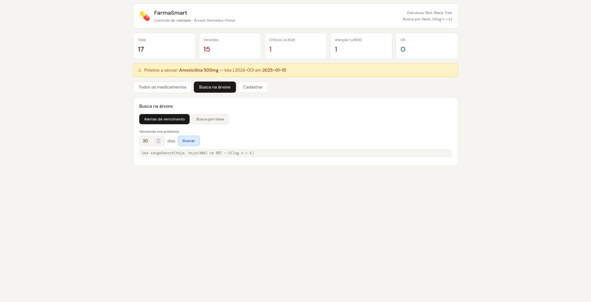

# FarmaSmart

**Conteúdo da Disciplina**: Estrutura de Dados e Algoritmos 2 (Árvore Vermelho-Preta)<br>

## Alunos
| Matrícula | Aluno |
| -- | -- |
| 231026616 | Davi Emanuel Ribeiro de Oliveira |
| 202045769 | Gabriel Saraiva Canabrava |

## Sobre
O projeto **FarmaSmart** é um sistema web para controle de validade e estoque de medicamentos. O objetivo principal é demonstrar, na prática, a aplicação de uma **Árvore Vermelho-Preta (Red-Black Tree)** como estrutura central de dados, organizando os medicamentos por **data de validade** para permitir buscas e atualizações eficientes em memória.

A aplicação possui um backend em Node.js com Express e um frontend em React. Os dados iniciais carregam medicamentos fictícios e a interface permite visualizar, cadastrar, remover e filtrar registros, além de consultar alertas de vencimento e buscas por intervalo de datas.

### Organização por data de validade
A árvore mantém os medicamentos ordenados pela validade, com desempate por identificador. Isso permite recuperar rapidamente o próximo medicamento a vencer, listar todos em ordem crescente e remover itens do estoque com eficiência.

### Operações implementadas
| Operação | Complexidade |
|----------|-------------|
| Inserção | O(log n) |
| Remoção | O(log n) |
| Busca por faixa de datas | O(log n + k) |
| Menor elemento (próximo a vencer) | O(log n) |
| Percurso em ordem | O(n) |

## Estrutura do Projeto
```
farmasmart/
├── backend/
│   └── src/
│       ├── server.js
│       ├── controllers/
│       │   └── medicamentosController.js
│       ├── data/
│       │   ├── db.js
│       │   └── RedBlackTree.js
│       └── routes/
│           └── api.js
└── frontend/
	└── src/
		├── App.js / App.css
		├── index.js
		├── components/
		│   ├── CardMedicamento.jsx
		│   ├── FormCadastro.jsx
		│   └── PainelBusca.jsx
		├── hooks/
		│   └── useFarma.js
		├── pages/
		│   └── Dashboard.jsx
		└── services/
			└── api.js
```

## Funcionalidades
- Listagem dos medicamentos ordenados por validade.
- Indicadores de status: vencidos, críticos, atenção e ok.
- Alerta do medicamento mais próximo do vencimento.
- Busca por faixa de datas.
- Consulta de alertas para os próximos N dias.
- Cadastro de novos medicamentos.
- Remoção de medicamentos do estoque.
- Lista de categorias disponíveis para cadastro.

## Endpoints
| Método | Rota | Descrição |
|--------|------|-----------|
| GET | /api/medicamentos | Lista todos os medicamentos com estatísticas e árvore serializada |
| GET | /api/medicamentos/faixa?inicio=YYYY-MM-DD&fim=YYYY-MM-DD | Busca medicamentos por intervalo de validade |
| GET | /api/medicamentos/alertas?dias=30 | Lista medicamentos que vencem nos próximos N dias |
| POST | /api/medicamentos | Cadastra um novo medicamento |
| DELETE | /api/medicamentos/:id | Remove um medicamento do estoque |
| GET | /api/categorias | Retorna as categorias disponíveis |

## Screenshots



## Instalação
**Linguagem**: JavaScript<br>

### Pré-requisitos:
- Node.js instalado.
- npm disponível no ambiente.

### Passos para Instalação:
1. Clone este repositório para a sua máquina.
2. Navegue até a pasta do projeto:
```bash
cd G36_Arvore_EDA2-2026.1-
```
3. Instale as dependências do backend e do frontend:
```bash
cd farmasmart/backend && npm install
cd ../frontend && npm install
```

## Uso
1. Inicie o backend em um terminal:
```bash
cd farmasmart/backend
npm run dev
```
2. Inicie o frontend em outro terminal:
```bash
cd farmasmart/frontend
npm start
```
3. Abra o navegador em:
**http://localhost:3000**
4. O backend responde em:
**http://localhost:3001**

## Como testar
- Use a aba **Todos os medicamentos** para ver a lista ordenada e os status de validade.
- Use a aba **Busca na árvore** para consultar alertas por dias ou buscar por intervalo de datas.
- Use a aba **Cadastrar** para inserir um novo medicamento com nome, lote, validade, quantidade e categoria.
- Remova itens do estoque diretamente nos cards de medicamento quando necessário.

## Vídeo

[Link Video](https://drive.google.com/file/d/1n-Am5BcwPIMAzPPFrQasMd7Rfc_-YlOA/view?usp=sharing)